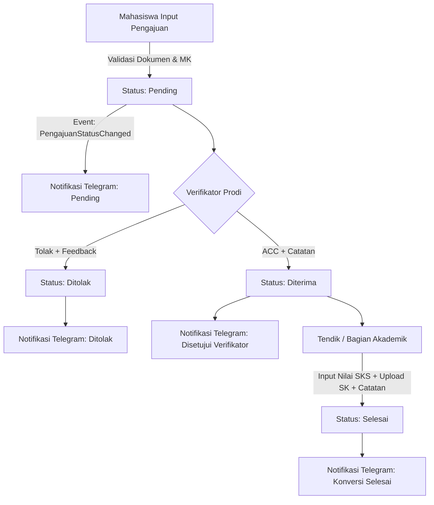

# SIMPRESMA Backend (API)

**Sistem Informasi Manajemen Prestasi Mahasiswa** — RESTful API Backend berbasis Laravel 11 untuk pengelolaan, verifikasi bertingkat, dan konversi reward prestasi perlombaan mahasiswa ke Satuan Kredit Semester (SKS) di lingkungan Fakultas Ilmu Komputer Universitas Jember.

---

## Daftar Isi
- [Gambaran Umum](#gambaran-umum)
- [Tech Stack](#tech-stack)
- [Arsitektur & Sistem Multi-Role](#arsitektur--sistem-multi-role)
- [Alur Bisnis & Konversi SKS](#alur-bisnis--konversi-sks)
- [Integrasi Telegram Bot](#integrasi-telegram-bot)
- [Katalog Endpoint API](#katalog-endpoint-api)
- [Keamanan & Global Error Handler](#keamanan--global-error-handler)
- [Panduan Instalasi](#panduan-instalasi)
- [Akun Pengujian (Seeder)](#akun-pengujian-seeder)
- [Pengujian Otomatis (Automated Tests)](#pengujian-otomatis-automated-tests)

---

## Gambaran Umum

SIMPRESMA Backend melayani seluruh kebutuhan proses bisnis konversi prestasi mahasiswa FASILKOM UNEJ. Sistem ini mengubah sertifikat dan bukti partisipasi lomba menjadi konversi nilai mata kuliah yang diakui secara akademis melalui verifikasi berjenjang dari dosen verifikator program studi hingga bagian akademik (Tendik).

---

## Tech Stack

| Komponen | Teknologi | Keterangan |
|---|---|---|
| **Framework** | Laravel 11.x | Arsitektur modern dengan `bootstrap/app.php` |
| **Bahasa Pemrograman** | PHP ≥ 8.2 | Type hinting ketat & null-safety |
| **Autentikasi** | Laravel Sanctum | Token-based Authentication (Bearer Token) |
| **Database** | MySQL / SQLite | MySQL untuk environment dev/prod, SQLite in-memory untuk testing |
| **Export Engine** | PhpSpreadsheet | Ekspor data laporan pengajuan berformat Excel (`.xlsx`) |
| **Notifikasi Real-time** | Telegram Bot API | Notifikasi instan event-driven untuk setiap update status |
| **Testing Suite** | PHPUnit & Pest | 73 unit & feature tests, 509 assertions (100% Pass) |

---

## Arsitektur & Sistem Multi-Role

SIMPRESMA menerapkan sistem otorisasi **Multi-Role Dinamis**, di mana satu akun pengguna dapat memiliki lebih dari satu role secara bersamaan dengan audit trail lengkap.

### 5 Role Pengguna:
1. **Mahasiswa (`mahasiswa`):**
   - Mengajukan klaim prestasi baru beserta dokumen wajib.
   - Memilih mata kuliah yang relevan dengan bidang lomba.
   - Memantau timeline status verifikasi, feedback, dan Surat Keputusan (SK).
2. **Dosen Verifikator (`verifikator`):**
   - Melakukan validasi pengajuan yang masuk sesuai lingkup program studi yang ditugaskan (Sistem Informasi, Teknologi Informasi, Informatika).
   - Menyetujui (ACC) atau menolak pengajuan dengan mencantumkan feedback/alasan penolakan.
3. **Bagian Akademik / Tendik (`tendik`):**
   - Memvalidasi pengajuan berstatus disetujui untuk penerbitan SK Konversi.
   - Menginput huruf nilai SKS (strict sesuai matriks reward).
   - Mengunggah link Surat Keputusan (SK) konversi resmi dan memberikan catatan akademik.
   - Mengekspor data pengajuan ke file Excel.
4. **Wakil Dekan I (`wadek`):**
   - Mengelola tabel Matriks Konversi Prestasi (rentang SKS & huruf nilai).
   - Menugaskan atau mencabut dosen verifikator untuk setiap program studi.
   - Mengelola pemetaan (*mapping*) Bidang Lomba terhadap Mata Kuliah kurikulum.
   - Memantau dashboard analitik dan statistik prestasi fakultas.
5. **Administrator (`admin`):**
   - Mengelola hak akses dan role pengguna (Multi-Role Management).
   - Menetapkan role baru (`assignRole`) atau mencabut role (`revokeRole`).
   - Memantau audit trail riwayat perubahan role pengguna (`role_history`).

---

## Alur Bisnis & Konversi SKS



### Aturan Bisnis Penting:
* **Validasi Dokumen Wajib:** Mahasiswa wajib melampirkan SK Tugas Mahasiswa, SK Tugas Dosen Pembimbing, Link Sertifikat, Link Poster Lomba, Link Publikasi Medsos, dan memilih Semester saat mengikuti lomba.
* **Snapshot Matriks *Immutable*:** Saat pengajuan disubmit, sistem mengunci nilai snapshot (`snapshot_min_sks`, `snapshot_max_sks`, `snapshot_huruf_nilai`). Perubahan matriks oleh Wadek di kemudian hari tidak akan mengubah pengajuan yang sudah berjalan.
* **Fleksibilitas SKS:** Mahasiswa dapat memilih SKS di bawah batas minimal jika sisa SKS kurikulumnya sudah mencukupi, namun tidak boleh melebihi batas maksimal matriks.
* **Strict Finalization:** Tendik wajib menginput huruf nilai yang persis sama dengan snapshot matriks yang telah disetujui.

---

## Integrasi Telegram Bot

SIMPRESMA terhubung langsung dengan bot Telegram resmi (`@simpresma_unej_bot`):
* **One-Click Deep Linking:** Mahasiswa dapat menautkan akun hanya dengan mengklik link unik berformat `https://t.me/<bot_username>?start=<link_token>`.
* **Real-time Push Notifications:**
  - Konfirmasi pengajuan berhasil dikirimkan ke mahasiswa.
  - Alert pemberitahuan pengajuan baru masuk ke dosen verifikator prodi.
  - Notifikasi hasil review (diterima / ditolak beserta feedback) ke mahasiswa.
  - Notifikasi penerbitan SK konversi dan catatan bagian akademik ke mahasiswa.

---

## Katalog Endpoint API

### 1. Autentikasi (`/api/auth`)
* `POST /api/auth/login` — Login pengguna dan perolehan Sanctum Bearer token.
* `POST /api/auth/logout` — Logout dan revocasi token aktif.
* `GET  /api/auth/me` — Ambil profil pengguna beserta list role aktif.
* `POST /api/auth/switch-role` — Berpindah role aktif untuk pengguna multi-role.

### 2. Data Referensi (`/api/ref`)
* `GET /api/ref/prodi` — Daftar Program Studi aktif.
* `GET /api/ref/tingkatan` — Tingkatan perlombaan (Internasional, Nasional, dll).
* `GET /api/ref/tahapan` — Tahapan capaian lomba (Juara 1-3, Harapan, Finalis, dll).
* `GET /api/ref/bidang` — Bidang perlombaan aktif.
* `GET /api/ref/mata-kuliah` — Daftar mata kuliah sesuai bidang lomba & prodi.

### 3. Mahasiswa (`/api/mahasiswa`)
* `GET  /api/mahasiswa/pengajuan` — List riwayat pengajuan milik mahasiswa (paginated).
* `POST /api/mahasiswa/pengajuan` — Submit pengajuan prestasi baru.
* `GET  /api/mahasiswa/pengajuan/{id}` — Detail lengkap status pengajuan mahasiswa.

### 4. Verifikator (`/api/verifikator`)
* `GET  /api/verifikator/pengajuan` — Antrean pengajuan sesuai scope prodi verifikator.
* `GET  /api/verifikator/pengajuan/{id}` — Detail pengajuan yang akan diverifikasi.
* `POST /api/verifikator/pengajuan/{id}/terima` — Menyetujui pengajuan prestasi.
* `POST /api/verifikator/pengajuan/{id}/tolak` — Menolak pengajuan dengan feedback wajib.

### 5. Tendik / Bagian Akademik (`/api/tendik`)
* `GET  /api/tendik/pengajuan` — Daftar pengajuan siap finalisasi & riwayat selesai.
* `GET  /api/tendik/pengajuan/{id}` — Detail pengajuan untuk finalisasi SK.
* `POST /api/tendik/pengajuan/{id}/finalisasi` — Input nilai SKS, upload SK, & catatan tendik.
* `GET  /api/tendik/export` — Ekspor laporan konversi prestasi ke Excel.

### 6. Wakil Dekan I (`/api/wadek`)
* `GET  /api/wadek/matriks` — Daftar seluruh matriks konversi SKS.
* `PUT  /api/wadek/matriks/{id}` — Update rentang SKS dan nilai pada matriks.
* `GET  /api/wadek/verifikator` — Daftar dosen verifikator aktif per prodi.
* `POST /api/wadek/verifikator/assign` — Menugaskan dosen sebagai verifikator prodi.
* `POST /api/wadek/verifikator/revoke` — Mencabut tugas verifikator prodi.
* `GET  /api/wadek/bidang-mk` — Pemetaan bidang lomba ke mata kuliah kurikulum.
* `POST /api/wadek/bidang-mk` — Tambah mapping bidang ke mata kuliah.
* `DELETE /api/wadek/bidang-mk/{id}` — Hapus mapping bidang ke mata kuliah.
* `GET  /api/wadek/export` — Ekspor laporan statistik prestasi fakultas ke Excel.

### 7. Administrator (`/api/admin`)
* `GET  /api/admin/users` — Daftar seluruh pengguna sistem dengan filter prodi/role.
* `POST /api/admin/users/{id}/roles/assign` — Menambahkan role ke pengguna.
* `POST /api/admin/users/{id}/roles/revoke` — Mencabut role dari pengguna.
* `GET  /api/admin/role-history` — Audit trail riwayat modifikasi role.

### 8. Shared & Integrasi
* `GET  /api/dashboard/statistik` — Data statistik pengajuan fakultas & prodi.
* `GET  /api/direktori-verifikator` — Direktori publik kontak dosen verifikator.
* `POST /api/telegram/generate-link` — Pembuatan tautan pairing Telegram bot.
* `GET  /api/telegram/status` — Pengecekan status keterhubungan akun Telegram.
* `POST /api/telegram/webhook` — Webhook handler untuk Telegram Bot API.

---

## Keamanan & Global Error Handler

SIMPRESMA menerapkan prinsip *Defense in Depth* dan *Security Hardening*:
1. **Redaksi Error 500:** Seluruh uncaught exception pada request API ditangkap oleh Global Exception Handler di `bootstrap/app.php`. Response tidak pernah mengekspos file path, baris kode, atau stack trace teknis ke client di production.
2. **Audit Logging Terpusat:** Detail exception teknis dicatat secara ketat hanya pada file log server di `storage/logs/laravel.log`.
3. **Format Respons Standar:**
   - Sukses: `{ "success": true, "message": "...", "data": ... }`
   - Gagal/Error: `{ "success": false, "status": "error", "message": "...", "errors": {...} }`

---

## Panduan Instalasi

### Prasyarat
* PHP ≥ 8.2 (dengan ekstensi `pdo_mysql`, `mbstring`, `openssl`, `gd`, `zip`)
* Composer ≥ 2.x
* MySQL ≥ 8.0

### Langkah Instalasi
```bash
# 1. Masuk ke direktori backend
cd simpresma

# 2. Install dependensi Composer
composer install

# 3. Buat file konfigurasi lingkungan (.env)
cp .env.example .env

# 4. Generate Application Key
php artisan key:generate

# 5. Konfigurasikan koneksi database di file .env:
#    DB_CONNECTION=mysql
#    DB_HOST=127.0.0.1
#    DB_PORT=3306
#    DB_DATABASE=simpresma
#    DB_USERNAME=root
#    DB_PASSWORD=

# 6. Jalankan migrasi database beserta seeder data awal
php artisan migrate:fresh --seed

# 7. Jalankan server backend development
php artisan serve
```
Aplikasi API siap diakses pada `http://localhost:8000`.

---

## Akun Pengujian (Seeder)

Seluruh akun default hasil seeder menggunakan password: `password` (kecuali Admin):

| Role | Email | Password Default | Keterangan |
|---|---|---|---|
| **Admin** | `admin@simpresma.unej.ac.id` | `admin123` | Multi-Role Administrator |
| **Mahasiswa SI** | `mhs.si@test.com` | `password` | Mahasiswa Prodi Sistem Informasi |
| **Mahasiswa TI** | `mhs.ti@test.com` | `password` | Mahasiswa Prodi Teknologi Informasi |
| **Mahasiswa IF** | `mhs.if@test.com` | `password` | Mahasiswa Prodi Informatika |
| **Verifikator SI** | `verif.si@test.com` | `password` | Dosen Verifikator Sistem Informasi |
| **Verifikator TI** | `verif.ti@test.com` | `password` | Dosen Verifikator Teknologi Informasi |
| **Tendik** | `tendik@test.com` | `password` | Staf Bagian Akademik Fakultas |
| **Wadek I** | `wadek@test.com` | `password` | Wakil Dekan I Bidang Akademik |

---

## Pengujian Otomatis (Automated Tests)

SIMPRESMA memiliki cakupan pengujian unit dan fitur yang komprehensif:

```bash
# Menjalankan seluruh test suite
php artisan test
```

### Hasil Pengujian Terakhir:
```text
   PASS  Tests\Unit\ExampleTest
   PASS  Tests\Unit\ServiceClassesTest
   PASS  Tests\Feature\ExampleTest
   PASS  Tests\Feature\HardeningTest
   PASS  Tests\Feature\MahasiswaModuleTest
   PASS  Tests\Feature\SharedModuleTest
   PASS  Tests\Feature\TendikModuleTest
   PASS  Tests\Feature\VerifikatorModuleTest
   PASS  Tests\Feature\WadekModuleTest

   Tests:    73 passed (509 assertions)
   Duration: 2.22s
```
Semua alur bisnis, proteksi hak akses, snapshot immutability, dan validasi data teruji dan berstatus **PASS (100%)**.
